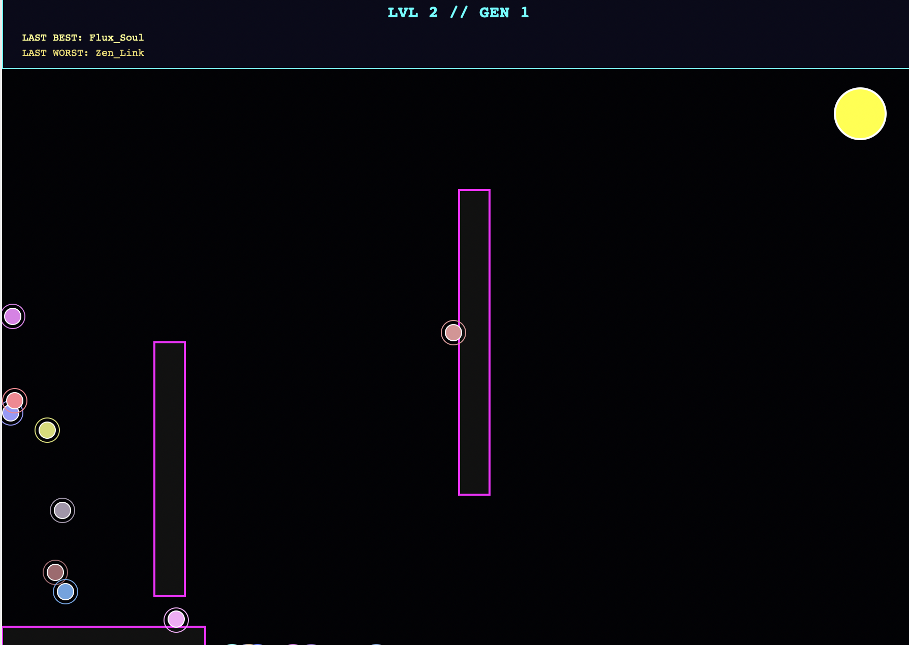
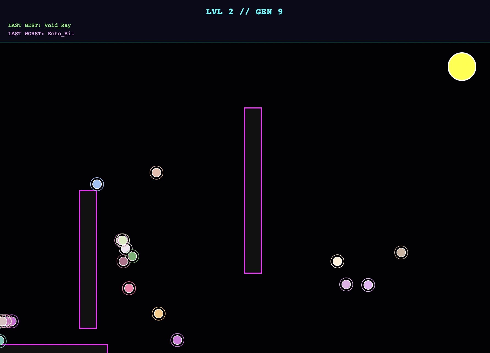
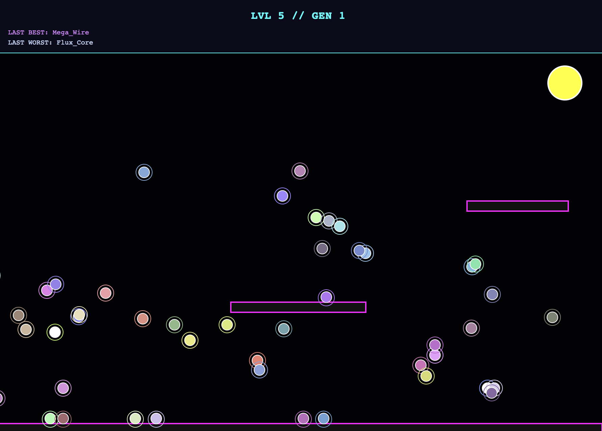

# Orb Evolution Simulator 🧬

A Python-based genetic algorithm visualization where autonomous agents ("Orbs") learn to navigate obstacle courses through natural selection, mutation, and trial-and-error physics.

---

## 📸 Evolution in Action

Below are snapshots of the simulation progressing through different generations and difficulty levels.

| **Generation 1: Initial Chaos** | **Generation 9: Learned Traversal** | **Level 5: Advanced Navigation** |
| :--- | :--- | :--- |
|  |  |  |
| *Orbs move randomly, frequently colliding with walls.* | *Successful patterns emerge as orbs avoid vertical pillars.* | *Advanced populations tackle complex horizontal platforms.* |

---

## 🚀 Overview

The **Orb Evolution Simulator** uses a population-based approach to solve spatial puzzles. Each Orb is a "Genome" containing a series of instructions. Over time, the simulation filters out unsuccessful movements and rewards those that bring the agent closer to the yellow goal.

### Key Features
* **Genetic DNA:** Each agent carries 700 "genes" (movement vectors).
* **Parkour Physics:** Supports double-jumping, wall-kicking, and high-velocity dashing.
* **Unique Identities:** Every orb is assigned a procedural name (e.g., `Neo_Core`, `Void_Ray`) and a distinct neon color.
* **Mutation Logic:** A 15% mutation rate ensures genetic diversity, preventing the population from getting stuck in "local optima."

---

## 🛠️ Technical Details

### The Genetic Algorithm
The simulation follows a standard evolutionary cycle:
1.  **Evaluation:** At the end of a generation, the "fitness" of each orb is calculated based on its distance to the goal.
2.  **Selection:** The top-performing genomes are kept to seed the next generation.
3.  **Mutation:** New orbs are created from the winners, with a `MUTATION` chance applied to their movement sequences to discover new paths.

### Physics & Constants
The engine simulates gravity and momentum using the following parameters:
* **Gravity:** $0.68$ units/frame.
* **Friction:** $0.92$ (Air resistance).
* **Jump Strength:** $-13$ for standard jumps, $-14$ for wall jumps.
* **Dash Interval:** 120 frames cooldown to prevent "flying" exploits.

---

## 💻 Code Snippet

The core logic is built using `tkinter` for rendering and basic vector math for movement.

```python
import tkinter as tk
import random
import math

# --- CONFIG ---
POP_SIZE = 250   # Population size per generation
GENES = 700      # Life span/steps of an orb
MUTATION = 0.15  # Chance of a gene changing
WIDTH, HEIGHT = 900, 650

def generate_name():
    p = ["Neo", "Vex", "Flux", "Echo", "Void", "Zen", "Astra", "Mega"]
    s = ["Node", "Core", "Link", "Soul", "Bit", "Wire", "Mina", "Ray"]
    return f"{random.choice(p)}_{random.choice(s)}"# Orb Evolution Simulator 🧬
```


